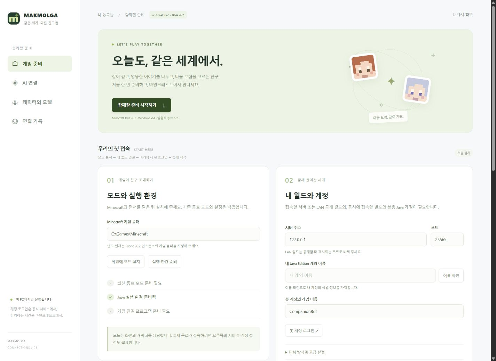

# MAKMOLGA · 맠몰가

**같이 걷고, 이야기하고, 다음 모험을 고르는 AI 친구.**

Minecraft Java 26.2 · Fabric · Windows x64 · 한국어

[설치판 받기](https://github.com/umaia1234/makmolga/releases/tag/v0.4.0-alpha.2) · [처음 시작하기](START-HERE.md) · [개인정보와 AI 사용량](docs/PRIVACY.md) · [문제 보고](https://github.com/umaia1234/makmolga/issues)

## 오늘도, 같은 세계에서

맠몰가는 캐릭터를 골라 마인크래프트에서 대화하고 동행하는 LLM 동료 프로젝트입니다. **v0.4.0-alpha.2는 기존 캐릭터를 모두 포함한 실험적 공개판**입니다. 설치 ZIP을 풀고 `Start-Makmolga.cmd`를 실행하면 게임 준비와 AI 연결을 한 화면에서 진행합니다.

공개 설치판에는 **얀로롱·지피짱·도로롱·젬짱·스피키·클짱·페짱**이 모두 들어 있습니다. 일곱 친구는 한 봇의 선택 가능한 캐릭터이며, 캐릭터별 스킨·성격·대화 기록을 구분합니다. 게임에서 **H**를 눌러 친구를 바꿀 수 있습니다.

alpha.1 설치판에서 빠졌던 기존 다섯 캐릭터를 alpha.2에서 복원했습니다. alpha.1을 받으셨다면 [업데이트 순서](START-HERE.md#다음부터--종료--업데이트)에 따라 새 ZIP으로 옮긴 뒤 모드를 다시 설치해 주세요.

## 처음 만나는 순서

1. **전체 ZIP을 풀고 시작 파일을 실행합니다.** 필요한 Node.js와 구성요소를 준비합니다.
2. **게임 폴더에 모드를 설치하고 내 월드를 연결합니다.** 게임 이름 확인·서버 입력·봇 계정 안내를 준비 화면에서 진행합니다.
3. **사용할 AI에 로그인하고 함께 시작합니다.** 게임에서 H로 친구를 고른 뒤 말을 걸어 주세요.

필요한 것은 Windows x64 PC, Java Edition 26.2, 접속할 서버/LAN 월드, 동시에 접속할 별도의 봇용 Minecraft 계정, 사용할 AI 계정입니다. 캐릭터 선택 화면은 모드만으로 사용할 수 있습니다. 실제 동료의 접속에는 별도 실행기가 필요합니다. 자세한 순서는 [시작 안내](START-HERE.md)에 있습니다.

## 이번 공개판의 범위

- **게임 안에서 만나는 캐릭터:** 3D 스킨 미리보기, 월드별 선택 저장, H 키로 변경, 연결된 봇의 클라이언트 스킨·이름표·채팅 표시.
- **대화와 동행:** 소유자 UUID를 확인한 게임 채팅, 이동·따라오기와 게임 작업 도구, 실제 작업 결과 기록. 일반 대화가 진행 중인 게임 작업을 자동 취소하지 않습니다.
- **설치와 시작 화면:** 고정 체크섬 다운로드, 기존 모드 백업, 사용자 게임 이름 조회, 서버 응답 확인, 동료 시작·중지·종료.
- **선택하는 AI:** 처음에는 Codex를 사용하며 캐릭터별 서비스·모델을 바꿀 수 있습니다. Claude Code도 연결합니다. Antigravity 어댑터는 실계정 검증이 남아 있습니다.
- **선택하는 자율성:** 먼저 말하고 행동하기, 시야 이미지 전달은 설정에서 켤 수 있습니다. AI 사용량이 발생합니다.

이 프로젝트의 중심은 자연스럽게 함께 노는 경험입니다. 작업 수행률이나 정해진 거절 횟수로 성격을 통제하지 않습니다. 멈춤 명령과 실제 작업 결과의 정합성은 유지합니다.

## 검증과 한계

자동검사는 상태 보존·중지·계정 경계·실제 로컬 패킷·설치 복구를 다룹니다. 기존 Java 26.2 로컬 월드에서는 실제 Codex 대화와 따라오기 완료를 기록했습니다. 현재 공개판의 실행 결과는 [릴리스 검증 기록](docs/RELEASE.md)에 따로 적습니다.

일반 온라인 봇 계정, 모든 작업의 실제 월드 결과, 다양한 PC와 장시간 자율 생존은 검증이 남아 있습니다. ViaProxy를 통해 26.1 봇 프로토콜을 26.2로 연결하므로 새 콘텐츠 전체의 의미를 보장하지 않습니다. VR·음성 통화·동시에 여러 봇을 운영하는 기능은 제공하지 않습니다.

## 개발과 자료

개발 원본과 설치판은 같은 7인 카탈로그를 사용합니다. 모드는 `./Build-Mod.ps1`으로 빌드합니다. 개발자 검사는 `npm ci`, `npm run check`, `npm test`입니다. 설치 ZIP은 `npm run release:package`로 만들고 ZIP을 다시 풀어 필수 파일·버전·체크섬·7인 카탈로그와 실제 JAR 안의 스킨까지 검사합니다.

각 리소스와 의존성의 권리는 [자료 안내](NOTICE.md)를 따릅니다. Mojang/Microsoft, OpenAI, Anthropic, Google의 공식 모드나 제휴 제품이 아닙니다.
