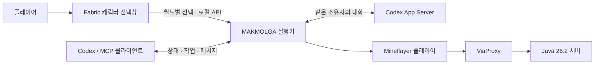

<div align="center">

# MAKMOLGA · 맠몰가

**마인크래프트 완전몰입형 가상현실을 향한 LLM 동료 프로젝트**

캐릭터를 고르고, 같은 세계에서 대화하고, 함께 일합니다.

`Java 26.2` · `Fabric` · `Mineflayer` · `MCP` · `한국어 페르소나`

[설치 파일](https://github.com/umaia1234/makmolga/releases/latest) · [설치부터 첫 대화까지](START-HERE.md) · [캐릭터 선택창](docs/CHARACTER-SELECTOR.md) · [로드맵](docs/ROADMAP.md)

</div>


**맠몰가**는 마인크래프트 안에서 함께할 LLM 동료를 만드는 프로젝트입니다. 현재 **v0.2.1**에는 네이티브 캐릭터 선택창, 별도 플레이어를 제어하는 Mineflayer 실행기, MCP 도구 15개, Codex App Server 대화 연결이 있습니다. 완전몰입형 가상현실은 프로젝트의 장기 목표이며, 현재 버전에 VR 기기 연동이나 감각 입출력 기능은 없습니다.

## 먼저, 함께할 친구를 고릅니다

| 캐릭터 | 성격 |
|---|---|
| **얀로롱** | LLM·JEPA 이야기를 매번 꺼내는 작은 박사님입니다. |
| **지피짱** | 차분하게 진단하고, 다정하게 실행을 독려합니다. |
| **도로롱** | 도로·doro 소리만으로 감정을 표현하고 함께 돕습니다. |
| **젬짱** | 자신감과 작은 좌절을 오가며 금세 다시 도전합니다. |
| **스피키** | 그럴듯한 흉내 사이로 속마음과 호박 애착이 드러납니다. |

새 월드든 기존 월드든 모드 설치 후 처음 접속하면 선택창이 열립니다. 마우스를 올리면 짧은 성격 설명이 뜨고, 선택은 월드별로 저장됩니다. **H 키** 또는 일시 정지 메뉴에서 언제든 다시 고를 수 있습니다. 게임 실행 중에 새 모드를 넣었다면 재시작이 필요합니다.

## 현재 할 수 있는 일

- **게임 안의 선택창:** 64×64 스킨을 실제 3D 플레이어 모델로 미리 봅니다. 서버와 LLM 없이도 사용할 수 있습니다.
- **별도 플레이어 제어:** 이동·시선·장착·식사·채굴·제작과 제한된 건축·농사·창고 정리·인챈트 동작을 제공합니다.
- **MCP 제어:** 상태를 읽고 작업을 시작한 뒤 실제 결과를 확인합니다. 작업은 한 번에 하나씩 실행합니다.
- **대화 연결:** 설정된 소유자 UUID의 Minecraft 채팅과 로컬 입력을 같은 Codex App Server 대화에 전달합니다.
- **캐릭터 성격:** 선택한 페르소나를 다음 LLM 대화에 참고 자료로 전달합니다. 사용자 원문과 중지 규칙은 유지하며, 도로롱은 도로 소리만 말하고 얀로롱은 매번 LLM·JEPA·밈을 언급합니다.
- **지속 실행:** 로컬 실행기가 접속·작업 상태를 유지하며 체력·산소를 확인합니다. 종료된 프로세스가 계속 플레이하지는 않습니다.

Java 26.2 로컬 월드에서 사용자와 봇의 동시 접속, 게임 채팅 → 실제 Codex 응답, 사용자 따라가기 완료까지 확인했습니다. 일반 온라인 계정과 장시간 자율 생존 검증은 남아 있습니다. 배포된 v0.2.1의 스킨은 선택창에만 적용됩니다. 소스의 **v0.2.2 개발 빌드**는 같은 월드의 인증된 로컬 실행기가 알려 준 봇 UUID에 선택한 스킨·이름표를 적용합니다. [지피짱의 실제 월드 스킨과 이름표](docs/images/gpchan-in-world-v022.png)는 사용자 플레이 화면으로 확인했습니다. 이 변경은 해당 클라이언트의 표시이며 Microsoft 계정의 전역 스킨을 바꾸지 않습니다.

## 빠른 시작

### 선택창부터 보기

1. Minecraft **26.2**용 **Fabric Loader 0.19.5** 프로필을 준비합니다.
2. [Releases](https://github.com/umaia1234/makmolga/releases/latest)의 설치 ZIP을 받아 `mods` 안 JAR 두 개를 해당 게임 폴더의 `mods`에 넣습니다.
3. Fabric 프로필로 실행하고 월드에 들어갑니다. 이후에는 **H 키**로 선택창을 엽니다.

설치·저장·연결 설정은 [캐릭터 선택창 안내](docs/CHARACTER-SELECTOR.md)에 있습니다.

### 동료 실행기 켜기

Node.js **22 이상**과 **JDK 25**를 준비합니다.

```sh
git clone https://github.com/umaia1234/makmolga.git
cd makmolga
npm ci
npm run setup -- --download-proxy
npm start
```

처음에는 서버 접속과 LLM 컨트롤러가 모두 꺼져 있습니다. 다른 터미널에서 `npm run ctl -- status`로 상태를 확인할 수 있습니다. 게임 선택창의 **연결 설정**에는 이 `makmolga` 폴더의 전체 경로를 넣습니다.

실제 동행에는 서버 주소와 소유자 UUID가 필요합니다. 정품 인증 서버에는 별도의 봇용 Java 계정을 연결합니다. 같은 PC에서만 접속하는 로컬 테스트 서버는 추가 계정 없이 테스트용 봇을 사용할 수 있습니다. `config.local.json`과 [실행 안내](docs/RUNTIME.md)를 참고하며, 인증 정보와 월드는 Git에 올리지 않습니다.

### Codex를 LLM 두뇌로 연결하기

게임 채팅 → MAKMOLGA 실행기 → **Codex App Server** → 이동·작업 도구 → 게임 내 답변 순서로 동작합니다. 아래 설정은 **게임 전용 Codex 대화**를 만들고 재사용합니다. 이 README의 명령은 `makmolga` 폴더에서 실행합니다.

**1. Codex 설치와 로그인 확인**

```powershell
codex --version
codex login status
```

`codex` 명령이 없다면 `npm install -g @openai/codex`로 CLI를 설치하고 터미널을 다시 엽니다. 로그인되어 있지 않으면 `codex login`을 실행해 브라우저에서 ChatGPT 로그인을 완료합니다. `Logged in using ChatGPT`가 나오면 준비된 상태입니다. 이 방식은 Codex의 ChatGPT 로그인과 사용량 한도를 사용하며 별도 OpenAI API 키를 입력하지 않습니다. [공식 로그인 안내](https://learn.chatgpt.com/docs/auth)

**2. 서버에 봇 연결**

`config.local.json`의 `minecraft.host`, `minecraft.port`를 실제 서버 주소로 설정합니다. LAN 월드는 `Esc → LAN에 공개` 후 표시된 포트를 사용합니다. 정품 인증 서버의 봇 계정 로그인은 `npm run setup -- --proxy-login`으로 열리는 ViaProxy의 Accounts에서 진행합니다.

서버 버전은 `26.2`, 봇 클라이언트는 `26.1`, `proxy.enabled=true`를 유지합니다. 실행기를 켠 뒤 다른 터미널에서 다음을 실행합니다.

```powershell
npm run ctl -- connect
npm run ctl -- observe
```

`connection: "connected"`와 봇 위치가 나와야 접속 완료입니다. 사용자님도 같은 서버에 들어간 뒤 `visiblePlayers`에서 **자신의 게임 이름과 UUID**를 확인합니다. `CompanionBot`의 UUID를 소유자 칸에 넣지 않습니다. 온라인 서버와 로컬 오프라인 서버의 UUID는 다를 수 있습니다.

**3. 자동 LLM 컨트롤러 켜기**

실행 중이면 `npm run ctl -- shutdown`으로 종료하고, `config.local.json`의 다음 부분을 수정합니다. 아래는 **수정할 필드만 보여 주는 예시**이며 다른 설정은 유지합니다.

```json
{
  "owner": {
    "username": "자신의_게임_이름",
    "uuid": "observe에서_확인한_자신의_UUID",
    "prefix": "!봇 "
  },
  "controller": {
    "enabled": true,
    "transport": "stdio",
    "command": "codex",
    "model": null,
    "replyInGame": true
  }
}
```

Windows에서 PowerShell에서는 `codex`가 실행되지만 컨트롤러에 `spawn codex ENOENT` 또는 `EINVAL`이 나오면 `command`에 실제 **codex.exe 전체 경로**를 넣습니다. `(Get-Command codex.exe).Source`로 확인할 수 있으며 JSON의 역슬래시는 `\\`로 적습니다. npm의 `codex.cmd` 래퍼는 직접 실행하지 않으며 실행 가능한 CLI 바이너리를 지정해야 합니다. `model=null`은 Codex의 모델 설정을 따릅니다.

npm으로 설치하여 `codex.exe`가 PATH에 없다면 아래에서 나온 실행 파일을 `command`에 지정합니다. 결과가 없으면 Windows용 CLI 설치 상태를 먼저 확인합니다.

```powershell
$codexPackages = Join-Path (npm.cmd root -g) '@openai'
Get-ChildItem -LiteralPath $codexPackages -Filter codex.exe -Recurse | Select-Object -ExpandProperty FullName
```

```powershell
# 터미널 A: 실행한 채로 둡니다.
npm start

# 터미널 B: 봇 접속 후 상태를 확인합니다.
npm run ctl -- connect
npm run ctl -- status
```

Windows 백그라운드 실행은 `./Start-Companion.ps1 -Background`입니다. `stdio` 모드에서는 실행기가 `codex app-server --listen stdio://`를 직접 띄우므로 App Server를 별도로 실행할 필요가 없습니다. 최초 메시지가 도착할 때 컨트롤러 대화가 만들어집니다. [공식 App Server 설명](https://learn.chatgpt.com/docs/app-server)

**4. 게임에서 대화하고 작업시키기**

H 키로 도우미를 고른 뒤 게임 채팅(T)에 입력합니다.

```text
!봇 안녕하세요. 지금 상태를 알려 주세요.
!봇 저를 따라와 주세요.
!봇 근처 나무를 확인하고 원목 세 개를 모아 주세요.
!봇 멈춰
```

로컬 터미널에서도 같은 게임 전용 대화로 보낼 수 있습니다.

```powershell
npm run ctl -- chat "저를 따라와 주세요"
npm run ctl -- events
```

`controller_ready`는 대화 연결, `controller_reply`는 실제 LLM 답변입니다. 물리 작업은 `job_started` 뒤에 `job_finished`의 결과까지 확인합니다. 도로롱은 답변이 도로 소리뿐이며 작업 결과는 `events`와 `job <작업 ID>`에서 읽습니다. 캐릭터를 바꾸면 다음 대화부터 새 말투가 적용됩니다.

`!봇 `은 기본 접두어이며 필수가 아닙니다. **일반 채팅으로 바로 대화하려면** `config.local.json`의 `owner.prefix`를 빈 문자열 `""`로 저장하고 실행기를 재시작합니다. 그러면 `따라와 주세요`, `집 지을 곳을 찾아 주세요`, `멈춰`처럼 입력할 수 있습니다. 이 모드에서는 소유자의 모든 일반 채팅이 Codex로 전달되며, 다른 플레이어나 서버 알림은 전달되지 않습니다. 현재 로컬 설치에는 이 설정을 적용했습니다.

게임 메시지는 설정된 소유자 UUID로 구분합니다. 기존 Codex Desktop 대화의 말풍선과 자동 병합되지는 않습니다. 이 Desktop 대화에서 직접 도구를 사용하려면 `npm run setup`이 생성한 `docs/mcp-config.toml`의 MCP 설정을 해당 클라이언트에 등록합니다. [운영 스킬](skills/minecraft-companion/SKILL.md)과 [MCP·공유 WebSocket 설명](skills/minecraft-companion/references/controller.md)에 두 모드의 차이가 있습니다.

**연결이 안 될 때**

| 확인한 상태 | 처리 |
|---|---|
| `disconnected` 또는 `connecting` | 서버 주소·포트와 봇 로그인을 먼저 확인합니다. LLM 연결과 게임 접속은 별개입니다. |
| `controller.threadId=null` | 컨트롤러 활성화·재시작·소유자 UUID·첫 메시지 전달을 확인합니다. |
| `controller_failed` 또는 `controller_disconnected` | `events`, Codex 로그인과 실행 경로를 확인한 뒤 실행기를 재시작합니다. |
| `controller_rate_limited` | 기본 시간당 30회 상한에 도달했습니다. 대기 메시지는 다음 허용 시점에 전달됩니다. |
| `uncertain` | 전송이 이미 접수됐을 수 있습니다. 기록을 확인하기 전 같은 작업을 다시 보내지 않습니다. |

작업 중지는 `npm run ctl -- stop`, 재개는 상태를 확인한 뒤 `npm run ctl -- resume`, 실행기 종료는 `npm run ctl -- shutdown`입니다. `config.local.json`, `runtime/`, Codex 로그인 파일은 공개하거나 Git에 커밋하지 않습니다.

### 이 PC에 준비된 로컬 테스트 월드

현재 설치에서 별도로 준비한 월드는 **Java 26.2 / 생존 / 보통 난이도**, 주소 **`127.0.0.1:25565`**입니다. 게임 서버 목록에서 **MAKMOLGA - Codex 동료**를 선택합니다. 서버 파일·월드는 `runtime/local-world/`에 있으며 이 폴더는 Git에서 제외됩니다. 다른 PC의 소스 다운로드에는 서버 JAR이나 월드가 포함되지 않습니다.

이미 준비한 월드를 다시 켤 때:

```powershell
# 서버 창은 열어 둡니다. 정상 종료는 이 창에서 stop을 입력합니다.
./Start-LocalWorld.ps1

# 다른 터미널에서 도우미를 켜고 접속합니다.
./Start-Companion.ps1 -Background
npm run ctl -- connect
```

로컬 설정은 서버의 `server-ip=127.0.0.1`, `online-mode=false`, `enforce-secure-profile=false`와 실행기의 `minecraft.auth="offline"`, `allowOfflineLocal=true`, `proxy.authMethod="NONE"`을 함께 사용합니다. 외부 접속용 설정이 아니며 일반 인증 서버에 접속할 때는 봇 계정과 `microsoft` / `ACCOUNT` 설정으로 되돌립니다. [공식 Java 서버 배포](https://www.minecraft.net/en-us/download/server)

## 구조



| 폴더 | 역할 |
|---|---|
| `fabric-mod/` | Java 26.2 클라이언트 모드, 화면, 스킨, 월드별 저장 |
| `character-pack/` | 다섯 캐릭터의 스킨·성격, 원본 기록과 표시용 목록 |
| `src/` | 실행기, 작업, 로컬 API, MCP, Codex 컨트롤러 |
| `scripts/` | 초기 설정, 환경 확인, 개발 검사 |
| `skills/minecraft-companion/` | 게임을 돕는 에이전트의 운영 지침 |
| `test/` | 실제 로컬 프로토콜 및 기능 회귀 테스트 |
| `docs/` | 설치·운영·동작 예제와 검증 기록 |

현재 Mineflayer 클라이언트는 **26.1**, 플레이 대상 서버는 **26.2**이며 ViaProxy가 프로토콜을 변환합니다. 새 콘텐츠 일부는 이전 버전의 표현으로 매핑될 수 있습니다. Fabric 선택창 모드 자체는 26.2용입니다.

## 개발과 검증

```sh
npm run check
npm test
cd fabric-mod
sh gradlew build
```

Windows에서는 루트의 `./Build-Mod.ps1`로 모드를 빌드합니다. 미리보기는 `./Build-Mod.ps1 -Preview`입니다. 빌드 결과는 `fabric-mod/build/libs/`에 생성됩니다. 최초 빌드는 의존성과 게임 리소스를 내려받습니다.

[GitHub Actions 설정](docs/github-actions/README.md)은 템플릿으로 제공합니다. 현재는 로그인 권한 범위로 인해 자동 빌드가 활성화되지 않았습니다.

v0.2.1 로컬 검증에서 **Node 31개 + Java 6개 테스트**가 통과했습니다. [말투·눈 수정](docs/PERSONA-UPDATE.md)과 [설치·실행 순서](START-HERE.md)를 확인해 주세요. 실제 Minecraft에서 새 월드·기존 월드의 자동 표시, H 키, 메뉴 버튼, 한글 툴팁, GUI 배율 2·3, 선택값의 로컬 실행기 전달을 확인했습니다. ViaProxy가 없는 환경에서는 해당 프로토콜 검사를 건너뛰므로 전체 검증에는 먼저 `npm run setup -- --download-proxy`를 실행합니다.

[검증 범위와 남은 항목](docs/CHARACTER-VALIDATION.md) · [배포 검증](docs/PUBLISH-VALIDATION.md) · [동작 예제](docs/ACTIONS.md) · [모든 구성요소](skills/minecraft-companion/references/architecture.md)

## 앞으로

현재의 선택창과 동료 실행기를 토대로 실제 서버 동행, 자연스러운 대화와 캐릭터 외형, 지속적인 기지 생활을 검증해 나갑니다. VR 기기 연동은 별도 연구 단계입니다. 단계별 범위는 [로드맵](docs/ROADMAP.md)에 정리했습니다.

원본 캐릭터 자료와 외부 프로젝트의 권리는 각 권리자에게 있습니다. [자료·라이선스 안내](NOTICE.md)를 확인해 주세요.
