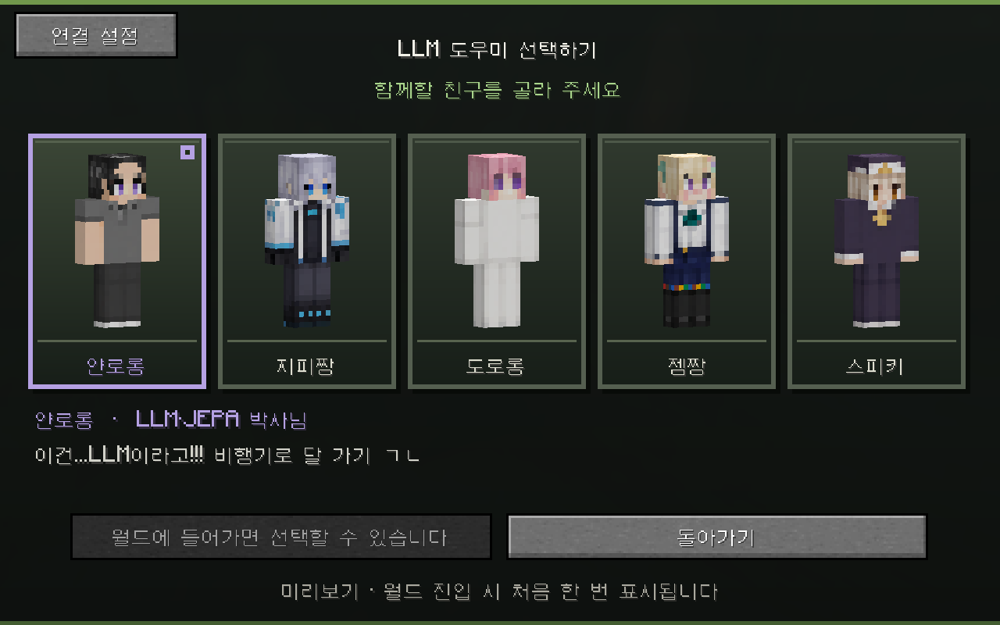
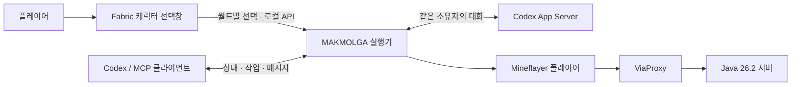

<div align="center">

# MAKMOLGA · 맠몰가

**마인크래프트 완전몰입형 가상현실을 향한 LLM 동료 프로젝트**

캐릭터를 고르고, 같은 세계에서 대화하고, 함께 일합니다.

`Java 26.2` · `Fabric` · `Mineflayer` · `MCP` · `한국어 페르소나`

[설치 파일](https://github.com/umaia1234/makmolga/releases/latest) · [설치부터 첫 대화까지](START-HERE.md) · [캐릭터 선택창](docs/CHARACTER-SELECTOR.md) · [로드맵](docs/ROADMAP.md)

</div>



**맠몰가**는 마인크래프트 안에서 함께할 LLM 동료를 만드는 프로젝트입니다. 현재 **v0.2.1**에는 네이티브 캐릭터 선택창, 별도 플레이어를 제어하는 Mineflayer 실행기, MCP 도구 15개, Codex App Server 대화 연결이 있습니다. 완전몰입형 가상현실은 프로젝트의 장기 목표이며, 현재 버전에 VR 기기 연동이나 감각 입출력 기능은 없습니다.

## 먼저, 함께할 친구를 고릅니다

| 캐릭터 | 성격 |
|---|---|
| **얀로롱** | LLM·JEPA 이야기를 매번 꺼내는 작은 박사님입니다. |
| **지피짱** | 차분하게 진단하고, 다정하게 실행을 독려합니다. |
| **도로롱** | 도로·doro 소리만으로 감정을 표현하고 함께 돕습니다. |
| **젬짱** | 자신감과 작은 좌절을 오가며 금세 다시 도전합니다. |
| **스피키** | 그럴듯한 흉내 사이로 속마음과 호박 애착이 드러납니다. |

새 월드든 기존 월드든 모드 설치 후 처음 접속하면 선택창이 열립니다. 마우스를 올리면 짧은 성격 설명이 뜨고, 선택은 월드별로 저장됩니다. **H 키** 또는 일시 정지 메뉴에서 언제든 다시 고를 수 있습니다. 게임 실행 중에 새 모드를 넣었다면 재시작이 필요합니다.

## 현재 할 수 있는 일

- **게임 안의 선택창:** 64×64 스킨을 실제 3D 플레이어 모델로 미리 봅니다. 서버와 LLM 없이도 사용할 수 있습니다.
- **별도 플레이어 제어:** 이동·시선·장착·식사·채굴·제작과 제한된 건축·농사·창고 정리·인챈트 동작을 제공합니다.
- **MCP 제어:** 상태를 읽고 작업을 시작한 뒤 실제 결과를 확인합니다. 작업은 한 번에 하나씩 실행합니다.
- **대화 연결:** 설정된 소유자 UUID의 Minecraft 채팅과 로컬 입력을 같은 Codex App Server 대화에 전달합니다.
- **캐릭터 성격:** 선택한 페르소나를 다음 LLM 대화에 참고 자료로 전달합니다. 사용자 원문과 중지 규칙은 유지하며, 도로롱은 도로 소리만 말하고 얀로롱은 매번 LLM·JEPA·밈을 언급합니다.
- **지속 실행:** 로컬 실행기가 접속·작업 상태를 유지하며 체력·산소를 확인합니다. 종료된 프로세스가 계속 플레이하지는 않습니다.

게임 내 선택과 실제 실행기 사이의 전달은 확인했습니다. 실제 계정으로 장시간 자율 플레이하거나 실제 LLM이 성격에 맞게 응답하는 검증은 아직 남아 있습니다. 선택창의 스킨 미리보기와 실제 봇 계정의 외형 변경은 별개입니다.

## 빠른 시작

### 선택창부터 보기

1. Minecraft **26.2**용 **Fabric Loader 0.19.5** 프로필을 준비합니다.
2. [Releases](https://github.com/umaia1234/makmolga/releases/latest)의 설치 ZIP을 받아 `mods` 안 JAR 두 개를 해당 게임 폴더의 `mods`에 넣습니다.
3. Fabric 프로필로 실행하고 월드에 들어갑니다. 이후에는 **H 키**로 선택창을 엽니다.

설치·저장·연결 설정은 [캐릭터 선택창 안내](docs/CHARACTER-SELECTOR.md)에 있습니다.

### 동료 실행기 켜기

Node.js **22 이상**과 **JDK 25**를 준비합니다.

```sh
git clone https://github.com/umaia1234/makmolga.git
cd makmolga
npm ci
npm run setup -- --download-proxy
npm start
```

처음에는 서버 접속과 LLM 컨트롤러가 모두 꺼져 있습니다. 다른 터미널에서 `npm run ctl -- status`로 상태를 확인할 수 있습니다. 게임 선택창의 **연결 설정**에는 이 `makmolga` 폴더의 전체 경로를 넣습니다.

실제 동행에는 서버 주소, 별도의 봇용 Java 계정, 소유자 UUID가 필요합니다. `config.local.json`을 설정하고 [실행 안내](docs/RUNTIME.md)에 따라 접속·LLM 대화를 켭니다. 인증 정보는 Git에 올리지 않습니다.

### Codex에서 제어하기

`npm run setup`이 이 체크아웃의 경로를 사용하는 MCP 설정을 로컬에 생성합니다. [운영 스킬](skills/minecraft-companion/SKILL.md)과 [컨트롤러 설명](skills/minecraft-companion/references/controller.md)을 참고합니다.

Minecraft 채팅은 소유자 UUID로 구분합니다. 기존 Codex Desktop 대화에 사용자 말풍선을 자동 삽입하거나 모든 대화를 자동 병합하는 기능은 아닙니다.

## 구조



| 폴더 | 역할 |
|---|---|
| `fabric-mod/` | Java 26.2 클라이언트 모드, 화면, 스킨, 월드별 저장 |
| `character-pack/` | 다섯 캐릭터의 스킨·성격, 원본 기록과 표시용 목록 |
| `src/` | 실행기, 작업, 로컬 API, MCP, Codex 컨트롤러 |
| `scripts/` | 초기 설정, 환경 확인, 개발 검사 |
| `skills/minecraft-companion/` | 게임을 돕는 에이전트의 운영 지침 |
| `test/` | 실제 로컬 프로토콜 및 기능 회귀 테스트 |
| `docs/` | 설치·운영·동작 예제와 검증 기록 |

현재 Mineflayer 클라이언트는 **26.1**, 플레이 대상 서버는 **26.2**이며 ViaProxy가 프로토콜을 변환합니다. 새 콘텐츠 일부는 이전 버전의 표현으로 매핑될 수 있습니다. Fabric 선택창 모드 자체는 26.2용입니다.

## 개발과 검증

```sh
npm run check
npm test
cd fabric-mod
sh gradlew build
```

Windows에서는 루트의 `./Build-Mod.ps1`로 모드를 빌드합니다. 미리보기는 `./Build-Mod.ps1 -Preview`입니다. 빌드 결과는 `fabric-mod/build/libs/`에 생성됩니다. 최초 빌드는 의존성과 게임 리소스를 내려받습니다.

[GitHub Actions 설정](docs/github-actions/README.md)은 템플릿으로 제공합니다. 현재는 로그인 권한 범위로 인해 자동 빌드가 활성화되지 않았습니다.

v0.2.1 로컬 검증에서 **Node 31개 + Java 6개 테스트**가 통과했습니다. [말투·눈 수정](docs/PERSONA-UPDATE.md)과 [설치·실행 순서](START-HERE.md)를 확인해 주세요. 실제 Minecraft에서 새 월드·기존 월드의 자동 표시, H 키, 메뉴 버튼, 한글 툴팁, GUI 배율 2·3, 선택값의 로컬 실행기 전달을 확인했습니다. ViaProxy가 없는 환경에서는 해당 프로토콜 검사를 건너뛰므로 전체 검증에는 먼저 `npm run setup -- --download-proxy`를 실행합니다.

[검증 범위와 남은 항목](docs/CHARACTER-VALIDATION.md) · [배포 검증](docs/PUBLISH-VALIDATION.md) · [동작 예제](docs/ACTIONS.md) · [모든 구성요소](skills/minecraft-companion/references/architecture.md)

## 앞으로

현재의 선택창과 동료 실행기를 토대로 실제 서버 동행, 자연스러운 대화와 캐릭터 외형, 지속적인 기지 생활을 검증해 나갑니다. VR 기기 연동은 별도 연구 단계입니다. 단계별 범위는 [로드맵](docs/ROADMAP.md)에 정리했습니다.

원본 캐릭터 자료와 외부 프로젝트의 권리는 각 권리자에게 있습니다. [자료·라이선스 안내](NOTICE.md)를 확인해 주세요.
