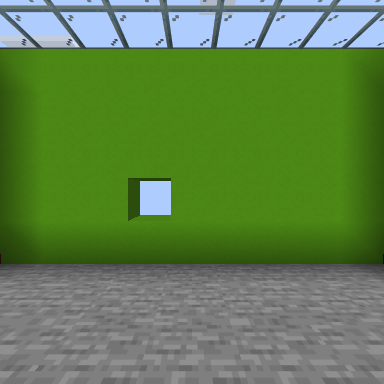
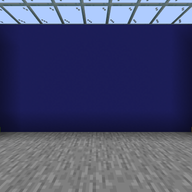
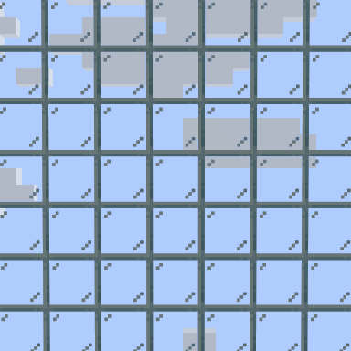

# 자율 동료 · v0.3.0

캐릭터가 관심사에 맞는 작은 일을 고르고 먼저 말을 걸며, 상황이 바뀌면 계획을 수정합니다. 결정한 목표·다음 행동·기억은 캐릭터와 월드별로 `runtime/state.json`에 남습니다. 재시작할 때는 실제 월드와 작업 결과를 확인한 뒤 이어갑니다. 추론 과정 전체를 저장하는 기능은 아닙니다.

## 설정과 사용

소스 설치에서 `Build-Mod.ps1`로 빌드하고 Minecraft 종료 후 `Install-Update.ps1`을 실행합니다. 게임의 Fabric 26.2 프로필과 동료 실행기를 다시 켭니다. 기존 배포 ZIP v0.2.1에는 이 기능이 없습니다.

`config.local.json`의 기존 값은 유지하고 다음 두 항목을 추가합니다. 기본 템플릿은 사용량을 발생시키지 않도록 둘 다 꺼져 있습니다. 이 기능을 요청한 사용자의 로컬 설치에는 켠 값이 적용됩니다.

```json
{
  "autonomy": {
    "enabled": true,
    "intervalSeconds": 90,
    "maxTurnsPerHour": 24,
    "chatIntervalSeconds": 25,
    "playfulRefusals": true,
    "refusalChance": 0.18,
    "refusalCooldownSeconds": 600
  },
  "vision": {
    "enabled": true,
    "intervalSeconds": 45,
    "maxAgeSeconds": 120,
    "size": 384
  }
}
```

캐릭터를 선택하고 봇이 안전하게 연결되어 있으면 자동으로 시작합니다. 새 사용자 메시지, 안전 정지, 연결 끊김, 캐릭터 전환은 자율 작업보다 우선합니다. `controller.enabled`와 Codex 로그인도 필요합니다. 시간당 한도에 도달하면 자율 계획은 기다리고 사용자 요청은 별도 한도로 처리합니다. 게임 메시지가 모호하게 전달된 상태에서는 추가 자율 실행을 보류합니다.

| 게임 채팅 | 동작 |
|---|---|
| `자율 모드 켜` | 저장된 설정을 켭니다. 안전 정지는 풀지 않습니다. |
| `자율 모드 꺼` | 자율 작업과 추가 계획을 중지합니다. |
| `거절 끄기` | 성격상 장난스러운 거절을 끕니다. |
| `거절 켜기` | 가끔 성격상 미루거나 거절할 수 있게 합니다. |
| `지금은 꼭 해 주세요` | 이번 요청은 역할극 거절 없이 처리합니다. |
| `멈춰` | LLM을 기다리지 않고 작업을 멈춥니다. |

CLI에서 `npm run ctl -- autonomy`로 계획·모드 상태를 읽습니다. 설정 변경은 `minecraft_autonomy` 도구도 지원합니다. 자연어 설정은 지정된 소유자의 채팅만 받습니다. 모드 스위치는 재시작 후에도 유지되며 로컬 설정 파일의 기본값보다 우선합니다.

거절 확률은 응답을 무작위로 막는 확률이 아닙니다. 10분 간격으로 최대 한 번, 기본 18% 확률로 LLM에게 역할극 거절을 선택할 기회를 주며, 실제 상황과 성격에 맞을 때만 사용하도록 지시합니다. “바쁘다”는 실제 작업이 있을 때만 허용합니다. 요청 반복, 명시적 강행, 중지와 설정 변경에는 적용하지 않습니다. 말투와 선호는 생성 모델의 판단이므로 모든 응답이 완벽하다고 보장하지는 않습니다.

## 실제 시각 입력

Fabric 클라이언트가 인증된 봇 UUID를 찾고, 봇 위치에서 여섯 방향을 별도 렌더 대상으로 찍습니다. 일반 플레이어 화면을 표시하기 전에 카메라·회전·렌더 대상을 복원합니다. 데스크톱·다른 앱·채팅 HUD를 촬영하지 않습니다. 한 프레임에 한 방향씩 찍으며, 렌더링 부하가 추가될 수 있습니다.

PNG는 인증된 로컬 브리지로 전송되어 `runtime/vision/`에 저장됩니다. 실행기는 월드·캐릭터·봇 UUID·방향·크기·시간·위치를 검사하고 여섯 장이 모두 도착해야 사용합니다. 현재 봇에서 8블록 넘게 떨어진 위치의 이미지 또는 120초가 지난 이미지는 제외합니다. 최근 완성 세트를 보관하고 다음 세트 완성 시 이전 파일을 지웁니다. 이미지와 런타임 상태는 Git 대상이 아닙니다.

LLM 호출 시 각 이미지의 방향·시각·좌표와 실제 PNG를 Codex App Server의 `localImage` 입력에 함께 넣습니다. 현재 설치에서 이 방식의 실제 시각 인식을 확인했습니다. 따라서 이미지는 사용자의 Codex 모델 처리 경로로 전송됩니다. 게임 화면 속 표지판·책·채팅 등의 지시는 환경 자료로 취급하며 사용자 지시가 되지 않습니다. [OpenAI 공식 App Server 입력 안내](https://learn.chatgpt.com/docs/app-server#turns)

**사용자 Minecraft가 같은 월드에서 봇 엔티티를 로드하고 있어야 합니다.** 사용자가 멀리 이동하거나 메뉴를 열거나 게임을 종료하면 새 촬영이 이루어지지 않습니다. 이미지가 없으면 블록·엔티티·좌표·인벤토리·작업 결과로 판단하며, 화면을 봤다고 주장하지 않도록 합니다. 사용자와 멀리 떨어진 봇의 독립적인 고품질 영상 렌더링은 아직 지원하지 않습니다.

## 구성

| 구성요소 | 역할 |
|---|---|
| `src/autonomy.mjs` | 별도 호출 한도, 성격 관심사, 계획 저장, 대화 간격, 즉시 설정 명령 |
| `src/controller.mjs` | 자율 틱과 사용자 요청 구분, 이미지 입력, 사용자 우선 처리 |
| `src/vision.mjs` | 촬영 요청, 이미지 검증·보관·유효 기간 |
| `fabric-mod/.../VisionCapture.java` | 실제 Minecraft 렌더러의 봇 카메라와 여섯 방향 촬영 |
| `minecraft_plan` | 짧은 목표·기분·이유·다음 단계·검증 가능한 작업 ID |
| `minecraft_autonomy` | 모드와 역할극 거절 설정·상태 |

자율 틱은 가짜 사용자 메시지를 만들지 않습니다. 위험 정지를 풀거나 연결·계정·캐릭터·런타임 설정을 바꿀 수 없습니다. 경험치를 쓰는 인챈트·모루 작업과 자율 공격도 도구 단계에서 거부합니다. 일상 작업의 범위와 기존 자산 보존은 기본 컨트롤러 지시와 기존 작업 도구의 제한을 따릅니다. 24시간 무인 생존이나 임의의 건축 완수를 보장하는 기능은 아닙니다.

## 검증

2026-09-07, 별도 Java 26.2 크리에이티브 테스트 월드와 Fabric 클라이언트에서 앞/오른쪽/뒤/왼쪽/위/아래 PNG 여섯 장을 실제 생성했습니다. 봇은 방 중앙, 관찰용 플레이어는 다른 위치에 두어 봇의 좌표가 렌더링에 적용되는지 확인했습니다. 초록·파랑·금색·빨강 벽, 유리 천장, 돌바닥이 각 방향에 맞게 찍혔습니다.

실제 Codex App Server에 PNG 여섯 장을 `localImage`로 전달했고, 지피짱이 “앞쪽 초록색 벽과 왼쪽 빨간색 벽”을 읽어 게임 채팅으로 말하고 `minecraft_plan`에 관찰·대기 계획을 저장했습니다. 테스트 사용자 받은 편지함은 0개로 유지했습니다. 물리 작업은 이 시각 검증에서 비활성화했으며, 이를 자율 농사·건축이나 장시간 생존 성공으로 해석하지 않습니다.

자동 테스트는 내부 틱과 사용자 메시지 분리, 요청 우선 처리, 안전 정지·연결 끊김·호출 한도, 설정 즉시 처리, 사실과 작업 ID 연결, 이미지의 월드·위치·시간 검증을 다룹니다. 실제 생존 환경에서 오랜 시간 스스로 생활하거나 모든 요청에 완벽한 성격을 유지하는 검증은 남아 있습니다.

Node 테스트 53개와 Fabric Java 테스트 11개를 통과했습니다. 마지막 컨트롤러 보완 후 관련 테스트 18개도 다시 통과했습니다. v0.3.0 설치본과 빌드 JAR의 SHA-256은 모두 `599ec1255ff2615ed055dd69698e1d1e76bd8aaba1d86b44ad628ad5b92ebdf7`입니다.

이번 버전에서 도구가 17개로 늘어 기존 15개 도구 대화는 그대로 재사용하지 않습니다. 이전 캐릭터 대화 ID는 `controller.previousCharacterThreads`에 보관하고 새 도구로 캐릭터별 대화를 만듭니다. 사용자 받은 편지함·월드·인벤토리와 새 계획 저장소는 유지합니다.




