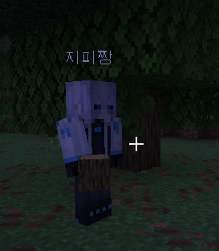

# Codex 실제 플레이 연결 기록

검증일: 2026-09-07 (한국 시간).

- 공식 SHA-1을 확인한 Java 26.2 서버를 `127.0.0.1:25565`에서 실행했습니다. 새 생존 월드, 보통 난이도이며 기존 싱글플레이 저장을 사용하지 않았습니다.
- Mineflayer 26.1 → ViaProxy 3.4.12 → 실제 Java 26.2 서버로 봇이 접속했습니다. 사용자 클라이언트도 같은 월드에 접속했습니다.
- `codex-cli 0.153.4`, ChatGPT 로그인, stdio App Server를 사용했습니다. 비밀 값은 문서나 Git에 저장하지 않았습니다.
- Codex 입력 원문과 실제 게임의 `!봇 저를 따라와 주세요`가 같은 컨트롤러 대화에 전달됐습니다. 게임 메시지의 소유자 UUID 일치를 확인했습니다.
- 실제 모델이 `follow` 도구를 호출했고, 60초 작업의 `job_finished.status=completed`와 좌표 변화를 확인했습니다. 최종 답변은 게임 채팅에 전달됐습니다.
- 집터 요청과 이어진 따라오기 요청도 게임에서 수신되어 좌표 이동과 후속 답변을 확인했습니다.

## 실제 봇 스킨 수정의 상태

v0.2.1은 선택창의 스킨만 바꿨기 때문에 월드에서는 기본 스킨과 `CompanionBot` 이름표가 보였습니다. v0.2.2 개발 빌드는 인증된 로컬 선택 응답에서 접속한 봇의 UUID를 받아 해당 플레이어의 스킨, 이름표, 탭 목록 표시를 바꿉니다. 다른 플레이어·다른 월드·만료된 연결에는 적용하지 않습니다. 계정 로그인 이름과 Microsoft 계정의 전역 스킨은 유지됩니다.

Node 32개 테스트와 Java 8개 테스트, 모드 빌드가 통과했습니다. 다른 UUID/월드 배제, 연결 해제·만료 시 기본 표시 복원, 브리지의 봇 UUID 전달을 검사했습니다.

사용자가 게임을 종료한 뒤 `Install-Update.ps1`로 기존 모드를 백업하고 v0.2.2를 설치했습니다. 실행기와 게임을 재시작하여 정상 로드와 봇 재접속을 확인했습니다. 이후 사용자가 제공한 실제 플레이 화면에서 **지피짱 스킨과 한글 이름표가 함께 적용된 것**을 확인했습니다. 다른 네 캐릭터의 실제 월드 외형과 LLM 응답을 각각 확인하는 검증은 남아 있습니다.

사용자의 자연스러운 대화 요청에 따라 로컬 `owner.prefix`를 빈 문자열로 변경하고 도우미를 재접속했습니다. 소유자의 접두어 없는 일반 채팅을 받아들이고 다른 UUID의 채팅은 거절하는 설정 검사를 통과했습니다.

일반 온라인 봇 계정, 장시간 생존, 모든 건축·농사·인챈트 동작의 실제 월드 검증은 이번 결과에 포함하지 않습니다.
