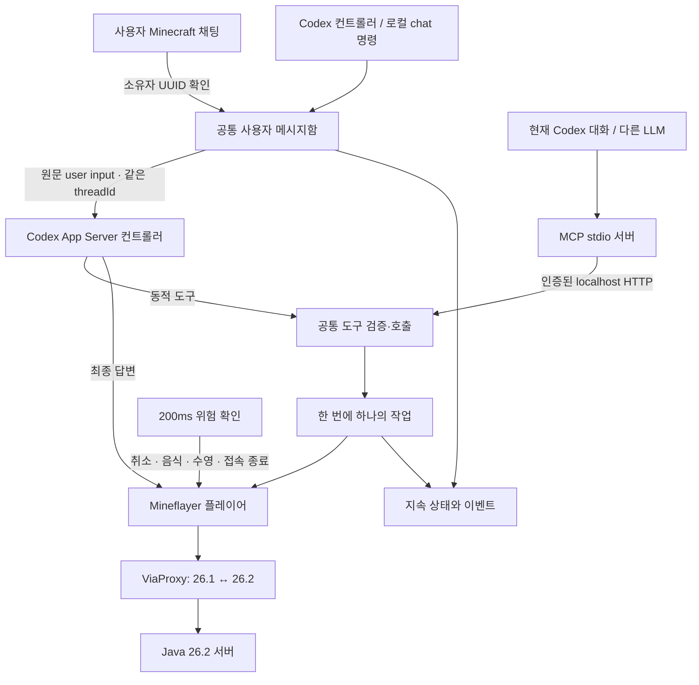

# 구성요소와 데이터 흐름

## 전체 연결

현재 Desktop 대화에서 호출하는 MCP와 App Server 컨트롤러는 같은 봇 실행기를 제어할 수 있지만, 서로 다른 대화라면 대화 이력이 자동으로 합쳐지지는 않습니다. 동시 작업 요청은 실행기의 단일 작업 제한으로 충돌을 막습니다.

## 각 소스 파일

| 파일 | 하는 일 | 실패 시 동작 |
|---|---|---|
| `src/main.mjs` | 설정 로드, PID 잠금, API·봇·컨트롤러 시작, 종료 정리 | 같은 runtime 폴더의 중복 프로세스 거부 |
| `src/config.mjs` | Zod 설정 검증, 경로와 기본값 | 잘못된 값·원격 오프라인 인증을 거부 |
| `src/runtime.mjs` | Mineflayer 수명, 상태 관측, 경로 탐색 설정, 위험 감지, 접속 재시도 | 체력·용암·사망·접속 실패를 이벤트로 남기고 동작 중단 |
| `src/actions.mjs` | 이동·제작·건축·농사·창고·인챈트의 실제 Mineflayer 호출 | 위치/아이템이 바뀌면 실패, 일부 수행 결과는 월드 확인 필요 |
| `src/jobs.mjs` | 작업 소유권, 취소 신호, 제한 시간, 진행률과 결과 | 취소가 1.5초 내 끝나지 않으면 연결 종료 요청; 이전 작업이 끝나기 전 새 작업 금지 |
| `src/chat.mjs` | UUID 기반 소유자 채팅 필터, 게임 응답 줄 분할 | 시스템 메시지·표시 이름만 있는 메시지·다른 UUID 무시 |
| `src/store.mjs` | 원자적 JSON 상태 저장, 메시지 ID 중복 제거, 이벤트 발행 | 손상된 JSON은 묵살하지 않고 시작 실패; 재시작 중간 상태를 interrupted/uncertain으로 전환 |
| `src/tools.mjs` | 15개 도구와 행동 인자 스키마, MCP와 컨트롤러의 공통 호출 경로 | 알 수 없는 도구/인자·중복 건축 좌표·잘못된 수량 거부 |
| `src/characters.mjs` | 다섯 캐릭터 목록, 월드·접속 대상 확인, LLM 성격 문맥 | 허용 ID만 선택, 성격 원문은 참고 데이터로 전달 |
| `fabric-mod/` | Fabric 26.2 네이티브 선택창·스킨·툴팁·H 키·설정 | 클라이언트 설정 저장, 로컬 API 인증, 렌더 스레드 밖의 HTTP |
| `src/api.mjs` | 127.0.0.1 HTTP API, Bearer 토큰, 본문 크기·Origin 검사 | 인증/입력 오류를 JSON으로 반환 |
| `src/client.mjs` | MCP/CLI에서 API에 접속, 파일에서 로컬 토큰 로드 | 연결 실패·오류·제한 시간을 호출자에게 전달 |
| `src/mcp.mjs` | MCP v2 SDK의 stdio 서버와 도구 등록 | 게임 실행기가 없으면 도구가 명시적 오류 반환 |
| `src/cli.mjs` | 상태·접속·작업·채팅을 터미널에서 호출 | 비정상 종료 코드와 오류 메시지 |
| `src/rpc.mjs` | Codex App Server JSON-RPC의 요청 ID·응답·알림·연결 종료 처리 | 미완료 요청을 거절하고 불확실한 결과를 상위 컨트롤러에 전달 |
| `src/controller.mjs` | 사용자 메시지를 한 Codex 대화에 전달, 활성 턴 steer, 동적 도구 처리, 최종 응답 중계 | 불확실 전달 자동 재시도 금지; 연결 장애 시 컨트롤러 중지 |
| `src/proxy.mjs` | 고정 버전/체크섬의 ViaProxy 실행, 포트 준비 확인 | 파일 변조·포트 점유·시작 실패를 거부 |

## 실행·설정·문서 파일

| 경로 | 역할 |
|---|---|
| `package.json`, `package-lock.json` | 설치와 테스트 명령, 정확한 의존성 재현 |
| `config.example.json` | 배포용 기본 설정, 로그인 정보 없음 |
| `config.local.json` | 이 PC에서 사용하는 설정; 사용자 계정 비밀번호는 넣지 않음 |
| `scripts/setup.mjs` | 기본 설정/MCP 경로 생성, 체크섬 검증 다운로드, 명시적 GUI 로그인 실행 |
| `scripts/doctor.mjs` | Java·Mineflayer·프로토콜 데이터·JAR 검사, 선택적 Mojang 최신 버전 확인 |
| `scripts/check.mjs` | 자바스크립트 구문 검사 |
| `scripts/codex-server.mjs` | CLI와 컨트롤러가 공유할 로컬 Codex WebSocket 서버 실행 |
| `Start-Companion.ps1` | Windows 전경 또는 숨김 백그라운드 실행 |
| `Stop-Companion.ps1` | 인증된 로컬 종료 요청으로 실행기와 봇 정상 종료 |
| `.codex/config.toml`, `docs/mcp-config.toml` | 이 폴더의 MCP stdio 실행 설정. 경로 이동 시 setup으로 다시 생성 필요 |
| `skills/minecraft-companion/SKILL.md` | 에이전트가 실제 플레이를 도울 때 읽는 절차 |
| `references/controller-prompt.md` | 새 컨트롤러 대화의 게임 제어 지침 |
| `test/*.test.mjs` | 제어/안전/메시지/MCP/프로토콜 변환 테스트 |

## 설정별 의미

- `minecraft`: 최종 서버 주소, 목표·클라이언트 버전, 봇 식별자, 접속 방식. `autoConnect`는 시작 시 자동 접속이고 `reconnectAttempts`는 연결이 끊긴 경우의 제한된 재시도 횟수입니다. 30초 동안 안정적으로 접속하면 횟수를 초기화합니다. 수동 접속 종료·임계 체력·사망에서는 자동 재접속하지 않습니다.
- `owner`: 실제 명령자의 이름과 UUID. `prefix`가 빈 문자열이면 해당 UUID의 모든 일반 플레이어 채팅을 지시로 전달합니다. `requireVerifiedChat=true`는 Mineflayer가 서명을 검증한 패킷만 허용합니다. 변환 경로나 서버가 서명 검증을 제공하지 않으면 메시지가 무시될 수 있으므로 먼저 확인합니다. 기본은 신뢰하는 서버가 제공하는 UUID를 기준으로 합니다.
- `api.port`: 로컬 제어 API 포트, 기본 47831. 테스트에서 `0`이면 운영체제가 빈 포트를 선택합니다.
- `proxy`: 사용 여부, 봇이 연결할 로컬 포트, Java 실행 경로, 검증된 JAR 경로, ViaProxy 계정 인증 방식/계정 순번. 프록시는 별도의 Java 자식 프로세스이며 봇과 함께 명시적으로 종료합니다.
- `safety`: 체력/산소 기준, 자동 식사 기준, 한 이동의 최대 거리, `return_home` 목적지. `home`을 설정한다고 자율 순찰이나 자동 귀환 목표가 생기지는 않습니다.
- `controller`: 자동 전달 사용 여부, App Server 통신 방식, Codex 실행 경로/로컬 WebSocket URL, 이 패키지가 만든 대화 ID, 선택적 모델, 게임 답변 중계, 전달/활성 턴 상한. `maxTurnsPerHour`는 실제 구현상 새 턴과 steer를 합친 메시지 전달 횟수를 셉니다. `idleTimeoutSeconds`는 마지막으로 전달된 요청 이후의 활성 턴 제한 시간입니다.

## 저장과 유지 범위

`runtime/state.json`에는 최근 200개 작업, 최근 1000개 이벤트, 사용자 메시지 및 전달 상태, 컨트롤러 대화 ID가 남습니다. 처리 전 메시지는 최대 200개입니다. 상태 파일 쓰기는 임시 파일 후 rename으로 교체합니다. 게임 자체의 월드/인벤토리 파일은 읽거나 수정하지 않습니다.

운영체제 입력기를 사용하지 않으므로 사용자님의 키보드와 마우스를 점유하지 않습니다. 별도 게임 창은 필수가 아닙니다. 모델 판단과 화면 묘사 대신 서버가 보낸 블록/엔티티/인벤토리 데이터를 봇이 사용합니다. 프레임별 게임 화면 스트리밍이나 3D 뷰어는 포함하지 않았습니다.

프로세스 재시작 후에는 월드 상태가 이전과 다를 수 있습니다. 중단된 작업을 자동 복원해 실행하지 않고 상태만 남깁니다. 계정 로그인 토큰은 인증 라이브러리/ViaProxy가 `runtime/` 아래에 관리합니다. MCP와 HTTP는 이 토큰을 외부에 반환하지 않습니다.

## 검증 경계

단위 테스트의 가짜 인벤토리/블록 모델은 제어 흐름과 불변 조건을 확인합니다. 로컬 패킷 서버 테스트는 실제 Mineflayer의 로그인·청크·물리 이동·채팅을 확인합니다. 두 ViaProxy 사이의 protocol 776 왕복은 26.2 변환 경로를 확인하지만, Mojang 26.2의 게임 규칙이나 새 콘텐츠 전체를 재현하지 않습니다.

실제 서버가 준비되면 안전한 기지에서 농사→창고→작은 건축→인챈트 순서로 관측 가능한 완료를 확인하고 장시간 동작 검증을 추가합니다. 결과는 패키지의 `docs/VALIDATION.md`에 덧붙입니다.
